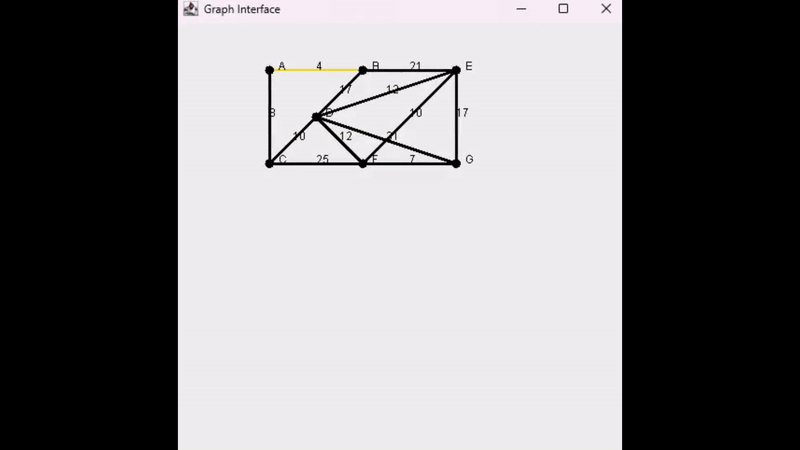

# DijkstraUi
A simple GUI to visualize Dijkstra's algorithm and find the shortest path in a weighted graph.



## Features
- Visualizes nodes and edges
- Highlights edges during algorithm execution:
    - **Orange** for evaluated edges
    - **Red** for invalid paths
    - **Green** for the shortest path


## How to Use
1. Clone the repo:
   ```bash
   git clone https://github.com/mrsnifo/DijkstraUi.git
   ```
2. Open the project in your Java IDE and run.
3. Add nodes/edges and run the algorithm.

## Requirements
- Java 8 or higher
- Any Java IDE